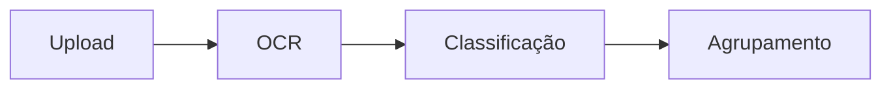

# Radon Doc Keeper 📝 📚

Use esta skill para manter a **documentação sincronizada com o código** e criar novos guias quando necessário.

---

## 🛑 REGRAS TRANSVERSAIS (NÃO QUEBRE)

> Essas 8 regras valem para todas as skills de documentação, debug e prompt:

1. **Contrato de Entrada/Saída**: Defina "inputs mínimos" + "outputs obrigatórios" + formato (JSON, checklist, doc).
2. **Definition of Done**: Build/test/e2e passando + links funcionando + checklist completo.
3. **Non-goals**: O que NÃO fazer neste PR (não refatorar, não renomear, não atualizar deps).
4. **Escopo por PR/commit**: 1 tipo de mudança por vez. PRs pequenos.
5. **Invariantes do repo**: Respeite áreas sagradas (`pipeline`/`grouping`/`env`/`offline`).
6. **Privacidade**: ZERO PHI em logs, docs ou prints (sem nomes/OS/IDs reais).
7. **Anti-scope creep**: Melhorias "boas" viram TODO/Issue, não entram no PR atual.
8. **Template de Handoff**: Sempre encerre com "o que fiz / como testar / riscos / rollback".

---

## ⚖️ DOC-OF-RECORD (Regra de Conflito)

> **Se a doc divergir do código, o CÓDIGO é fonte de verdade.**
> A doc deve ser corrigida no MESMO PR que alterou o código.

---

## 🎯 FILOSOFIA DE DOCUMENTAÇÃO

> **"Documentação desatualizada é pior que nenhuma documentação."**

- Docs devem ser **atualizadas junto com o código**
- Docs devem ser **encontráveis** (local previsível)
- Docs devem ser **úteis** (não burocracia)
- **Evite detalhes voláteis**: Passos exatos de deploy envelhecem rápido. Prefira princípios + links.

---

## 📁 ESTRUTURA DE DOCS DO PROJETO

```
docs/
├── README.md               # Entrada principal, links para tudo
├── INDEX.md                # Índice completo (TODA doc deve estar linkada aqui)
├── GLOSSARY.md             # ✨ NOVO: Termos fixos (classifications, statuses, jobs)
├── LLM_PROMPTS.md          # Catálogo obrigatório de prompts (atualizar a cada mudança)
│
├── architecture/           # Como o sistema funciona
│   ├── ARCHITECTURE.md
│   ├── AI_PIPELINE.md
│   ├── DATA_MODELS.md
│   ├── PROJECT_STRUCTURE.md
│   └── REFACTORING_*.md
│
├── guides/                 # Como fazer coisas
│   ├── REFACTORING_SUPER_PROMPT.md
│   ├── AI_GUIDE_VERCEL.md
│   └── [outros guias]
│
├── specs/                  # Especificações de features
│   ├── DESIGN_*.md
│   └── [specs por feature]
│
├── changelog/              # Histórico de mudanças
│   └── [por release/data]
│
├── testing/                # Guias de teste
│   └── E2E_TESTING_GUIDE.md
│
└── archive/                # Docs obsoletas (não deletar)
    └── [docs antigas]
```

---

## 📝 HEADER OBRIGATÓRIO (Frontmatter)

Toda doc em `docs/` deve começar com:

```markdown
---
owner: [Time ou Pessoa]
last_updated: YYYY-MM-DD
status: active | deprecated | archived
---
```

---

## 🔍 DOC LINT (Checklist antes de commitar)

- [ ] Links são **relativos** (`./guia.md`), NUNCA absolutos (`file:///...`)
- [ ] Arquivo está listado no `docs/INDEX.md`
- [ ] Sem PHI (dados reais de pacientes)
- [ ] Se mudou prompt → atualizou `docs/LLM_PROMPTS.md`
- [ ] Se criou termo novo → adicionou ao `docs/GLOSSARY.md`

---

## 📋 QUANDO DOCUMENTAR

### ✅ SEMPRE documentar:
| Situação | Doc necessária | Onde |
|----------|----------------|------|
| Nova feature grande | Design doc | `docs/specs/DESIGN_<feature>.md` |
| Mudança de arquitetura | Update | `docs/architecture/ARCHITECTURE.md` |
| Novo prompt de IA | Catálogo | `docs/LLM_PROMPTS.md` |
| Bug complexo resolvido | Post-mortem | `docs/changelog/` ou comentário no código |
| Processo novo | Guia | `docs/guides/` |
| Handoff para outro dev | Handoff doc | `docs/HANDOFF_*.md` |
| Termo/status novo | Glossário | `docs/GLOSSARY.md` |

### ❌ NÃO precisa documentar:
- Mudanças triviais (typos, refactors mecânicos)
- Código auto-explicativo
- Detalhes que já estão em comentários no código

---

## 📄 TEMPLATES DE DOCUMENTAÇÃO

### 1. Design Doc (Nova Feature)

```markdown
---
owner: Radon Team
last_updated: YYYY-MM-DD
status: active
---

# Design: [Nome da Feature]

## Problema
[O que precisa ser resolvido]

## Solução Proposta
[Como vai resolver]

## Arquivos Afetados
- `src/features/xxx/` (novo)
- `src/hooks/xxx.ts` (modificado)

## Fluxo de Dados
[Diagrama ou descrição do fluxo]

## Riscos e Mitigações
| Risco | Mitigação |
|-------|-----------|
| ... | ... |

## Checklist de Implementação
- [ ] Criar tipos
- [ ] Criar hook
- [ ] Criar componente
- [ ] Integrar
- [ ] Testar

## Status
- [ ] Em design
- [ ] Aprovado
- [ ] Em implementação
- [ ] Concluído
```

### 2. Handoff Doc (Passagem de Bastão)

```markdown
---
owner: [Quem fez]
last_updated: YYYY-MM-DD
status: active
---

# Handoff: [Nome do Trabalho]

**Data:** YYYY-MM-DD
**De:** [Quem fez]
**Para:** [Quem vai continuar]

## O que foi feito
- [Lista de implementações]
- [Commits relevantes]

## O que falta
- [ ] [Pendências]

## Arquivos Principais
| Arquivo | O que faz |
|---------|-----------|
| ... | ... |

## Como testar
1. [Passos]

## Bugs conhecidos
- [Se houver]

## Decisões tomadas
- [Porquê escolheu X em vez de Y]

## Riscos e Rollback
- Se quebrar: reverter commit X
```

### 3. Post-mortem (Bug Complexo)

```markdown
---
owner: [Time]
last_updated: YYYY-MM-DD
status: archived
---

# Post-mortem: [Nome do Bug]

**Data:** YYYY-MM-DD
**Severidade:** Alta/Média/Baixa

## O que aconteceu
[Descrição do problema]

## Impacto
[Quem/o que foi afetado]

## Causa raiz
[Por que aconteceu]

## Solução
[Como foi resolvido]

## Commits
- abc123: fix: ...

## Prevenção futura
[O que fazer para não acontecer de novo]

## Lições aprendidas
- [Insights]
```

---

## ✍️ BOAS PRÁTICAS DE ESCRITA

### 1. Use Markdown rico
```markdown
# Cabeçalhos para estrutura

**Negrito** para termos importantes

`código` para nomes de arquivos/funções

| Tabelas | Para | Dados |
|---------|------|-------|
| Estruturados | ... | ... |

- Listas para passos
- E opções

> Citações para destacar

```code blocks para exemplos```
```

### 2. Seja conciso
```markdown
# RUIM - muito texto
A funcionalidade de upload permite que o usuário faça o upload de 
arquivos PDF que serão processados pelo sistema de OCR para extrair
o texto contido nas imagens...

# BOM - direto ao ponto
Upload de PDF → OCR → Texto extraído
```

### 3. Use diagramas quando ajudar
```markdown

```

### 4. Mantenha links relativos
```markdown
# RUIM - link absoluto quebra
[Arquitetura](file:///Users/joao/projeto/docs/ARCHITECTURE.md)

# BOM - link relativo funciona sempre
[Arquitetura](./architecture/ARCHITECTURE.md)
```

---

## 🔄 PROCESSO DE ATUALIZAÇÃO

### Ao fazer mudança no código:

```markdown
1. [ ] A mudança afeta alguma doc existente?
   - Se sim: atualizar no MESMO PR

2. [ ] A mudança precisa de doc nova?
   - Feature grande → Design doc
   - Processo novo → Guia
   - Bug complexo → Post-mortem

3. [ ] Alguém vai continuar o trabalho?
   - Se sim: escrever Handoff doc
```

### Ao revisar PR:

```markdown
- [ ] Mudanças de arquitetura têm doc atualizada?
- [ ] Novos prompts estão no catálogo (`docs/LLM_PROMPTS.md`)?
- [ ] Novos componentes têm comentários JSDoc?
- [ ] Termos novos adicionados ao `docs/GLOSSARY.md`?
```

---

## 📍 ONDE DOCUMENTAR O QUÊ

| Tipo de informação | Onde colocar |
|--------------------|--------------|
| Como o sistema funciona | `docs/architecture/` |
| Como fazer algo | `docs/guides/` |
| Especificação de feature | `docs/specs/` |
| O que mudou (release) | `docs/changelog/` |
| Como testar | `docs/testing/` |
| API de um componente | Comentário JSDoc no código |
| Decisão pontual | Comentário inline no código |
| TODO técnico | Issue no GitHub |
| Termos e status fixos | `docs/GLOSSARY.md` |

---

## 📝 DOCUMENTAÇÃO NO CÓDIGO

### 1. JSDoc para funções públicas
```typescript
/**
 * Agrupa documentos por PDF de origem e hints da IA.
 * 
 * @param docs - Lista de documentos processados
 * @returns Lista de grupos, cada um com seus docs
 * 
 * @example
 * const groups = groupDocsVisuals(session.docs);
 */
export function groupDocsVisuals(docs: AttachmentDoc[]): ReportGroup[] {
```

### 2. Comentários para "porquê", não "o quê"
```typescript
// RUIM - óbvio pelo código
// Incrementa o contador
count++;

// BOM - explica a razão
// Gemini às vezes retorna array em vez de objeto, 
// então normalizamos para sempre ter objeto
const normalized = Array.isArray(data) ? data[0] : data;
```

### 3. TODO com contexto
```typescript
// RUIM
// TODO: fix this

// BOM
// TODO(2024-01): Remover fallback após migração do Firebase v8 → v9
```

---

## 🗂️ MANUTENÇÃO DE DOCS

### Revisão periódica (sugestão: mensal)
```markdown
- [ ] Docs de arquitetura ainda refletem o código?
- [ ] Links internos funcionam?
- [ ] Há docs orphan (não linkadas de lugar nenhum)?
- [ ] Algo deveria ir para archive/?
```

### Ao arquivar doc
```markdown
1. Mover para docs/archive/
2. Adicionar header:
   > ⚠️ **ARQUIVADO**: Este doc é histórico. Ver [doc atual](link).
3. Atualizar links que apontavam para ele
```

---

## 📊 CHECKLIST FINAL DE DOC PRONTA

Antes de considerar documentação "pronta":

```markdown
## Checklist de Doc

**Conteúdo**
- [ ] Tem frontmatter (owner, status, last_updated)
- [ ] Tem objetivo claro no início
- [ ] Responde "o quê", "por quê" e "como"
- [ ] Exemplos quando aplicável
- [ ] Links para recursos relacionados

**Formatação**
- [ ] Markdown válido
- [ ] Cabeçalhos hierárquicos
- [ ] Código formatado em blocos
- [ ] Tabelas onde ajuda

**Localização**
- [ ] Está na pasta correta
- [ ] Linkado do INDEX.md ou README
- [ ] Nome de arquivo descritivo

**Manutenibilidade**
- [ ] Links relativos (não absolutos)
- [ ] Sem informação que vai ficar stale rápido
- [ ] Sem PHI

**PR Checklist**
- [ ] Risco/mitigação documentado
- [ ] Como testar descrito
```

---

## 🎯 REGRAS DE OURO

1. **Atualize docs junto com código** - nunca deixe pra depois
2. **Uma fonte de verdade** - não duplique informação
3. **Documentação é parte do PR** - reviewers devem cobrar
4. **Menos é mais** - doc concisa > doc gigante que ninguém lê
5. **Se perguntaram 2x, documente** - FAQ natural
6. **Código vence doc** - se divergir, corrija a doc

---

> 💡 **Regra Final:** Escreva a doc que você gostaria de encontrar quando pegar o código de outra pessoa às 23h de sexta.
